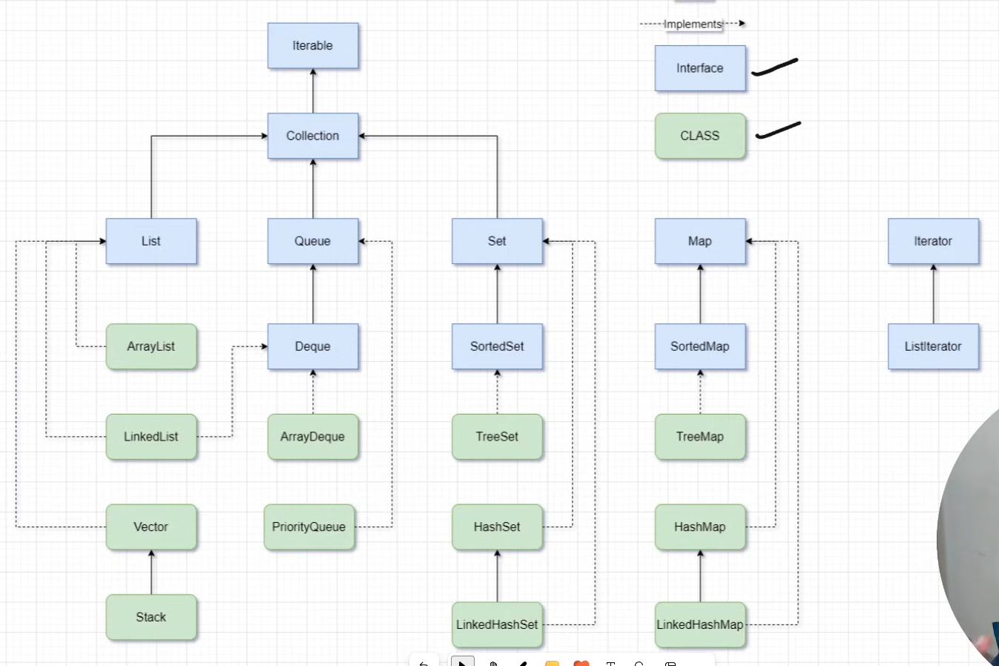

---

# 1. What is Collection Framework?

The Java Collection Framework provides classes and interfaces to store and manipulate groups of objects.

Common interfaces:

```java
Collection
   |
   +---- List
   |        |
   |        +---- ArrayList
   |        +---- LinkedList
   |
   +---- Set
   |
   +---- Queue
```

Your code uses:

```java
List<Integer> list = new ArrayList<>();
```

---

# 2. Why ArrayList?

Normal array:

```java
int arr[] = new int[5];
```

Problems:

* Fixed size
* Cannot grow dynamically

ArrayList solves this:

```java
ArrayList<Integer> list = new ArrayList<>();
```

Advantages:

✅ Dynamic size

✅ Built-in methods

✅ Easy insertion/removal

---

# 3. Generics (`<Integer>`)

```java
ArrayList<Integer> list = new ArrayList<>();
```

`Integer` means:

Only Integer objects are allowed.

Valid:

```java
list.add(10);
```

Invalid:

```java
list.add("Hello");
```

Compile-time error.

---

# 4. Autoboxing and Unboxing

### Before Java 5

```java
Integer num = Integer.valueOf(10);
```

### After Java 5

```java
list.add(10);
```

Java automatically converts:

```java
10
```

to

```java
Integer.valueOf(10)
```

This is called:

### Autoboxing

Primitive → Wrapper

```java
int -> Integer
double -> Double
char -> Character
```

---

### Unboxing

```java
Integer x = 10;
int y = x;
```

Java automatically converts:

```java
Integer -> int
```

---

# 5. add()

```java
list.add(7);
list.add(9);
```

Result:

```java
[7, 9]
```

Adds element at the end.

---

# 6. add(index, value)

```java
list.add(1,5);
```

Current:

```java
[7,9]
```

Insert 5 at index 1.

Result:

```java
[7,5,9]
```

Elements shift right.

---

# 7. set(index, value)

```java
list.set(1,6);
```

Current:

```java
[7,5,9]
```

Replace index 1.

Result:

```java
[7,6,9]
```

Difference:

### add()

Inserts

### set()

Replaces

---

# 8. addFirst() and addLast()

```java
list.addFirst(10);
list.addLast(8);
```

Result:

```java
[10,7,6,9,8]
```

---

### Important

These methods are available in modern Java versions because List now supports them.

Earlier:

```java
list.add(0,10);
```

was used.

---

# 9. remove()

There are two versions:

---

### remove(index)

```java
list.remove(3);
```

Current:

```java
[10,7,6,9,8]
```

Remove index 3.

Result:

```java
[10,7,6,8]
```

---

### remove(Object)

```java
list.remove(Integer.valueOf(8));
```

Remove value 8.

Result:

```java
[10,7,6]
```

---

### Why Integer.valueOf()?

If you write:

```java
list.remove(8);
```

Java thinks:

```java
remove(index)
```

and tries to remove index 8.

Therefore:

```java
remove(Integer.valueOf(8))
```

forces Java to call:

```java
remove(Object)
```

---

# 10. Custom Objects in ArrayList

```java
List<Student> list2 = new ArrayList<>();
```

Stores Student objects.

---

Adding objects:

```java
list2.add(new Student(1,"shashwat"));
list2.add(new Student(2,"aman"));
```

Memory:

```
list2
 |
 +--> Student(1,"shashwat")
 |
 +--> Student(2,"aman")
```

---

# 11. toString()

Without overriding:

```java
System.out.println(student);
```

Output:

```java
Student@12ab45
```

Garbage output.

---

After overriding:

```java
@Override
public String toString() {
    return "[" + name + " , " + rollNo + "]";
}
```

Output:

```java
[aman , 2]
```

---

# 12. equals()

Very Important Interview Topic

---

Without equals():

```java
Student s1 = new Student(1,"Aman");
Student s2 = new Student(1,"Aman");

System.out.println(s1.equals(s2));
```

Output:

```java
false
```

Because:

Java compares memory addresses.

---

Your override:

```java
@Override
public boolean equals(Object obj) {
    if(obj instanceof Student s){
        return this.rollNo == s.rollNo &&
               this.name.equals(s.name);
    }
    return false;
}
```

Now:

```java
new Student(1,"Aman")
```

and

```java
new Student(1,"Aman")
```

are considered equal.

Output:

```java
true
```

---

# 13. Why remove() Works Here?

```java
list2.remove(new Student(2,"aman"));
```

Java internally does:

```java
existingStudent.equals(new Student(2,"aman"))
```

Since equals() is overridden:

```java
true
```

Student gets removed.

Without equals():

```java
false
```

Nothing removed.

---

# 14. ListIterator

Normal Iterator:

```java
Iterator<Student> itr
```

Can move only forward.

---

ListIterator:

```java
ListIterator<Student> listIterator
```

Can move:

✅ Forward

✅ Backward

✅ Add

✅ Remove

✅ Update

---

Creation:

```java
ListIterator<Student> listIterator
    = list2.listIterator();
```

---

# 15. Forward Traversal

```java
while(listIterator.hasNext()){
    System.out.println(listIterator.next());
}
```

Flow:

```
cursor -> first
next()
cursor -> second
next()
```

Output:

```java
[shashwat , 1]
```

---

# 16. Backward Traversal

```java
while(listIterator.hasPrevious()){
    System.out.println(listIterator.previous());
}
```

Moves backward.

This is impossible with normal Iterator.

---

# 17. Enhanced For Loop

```java
for(Student s : list2)
```

Internally:

```java
Iterator<Student> itr = list2.iterator();
```

Java automatically uses Iterator.

---

# 18. size()

```java
list2.size()
```

Returns:

```java
number of elements
```

---

# 19. Collections.sort()

```java
Collections.sort(list);
```

Before:

```java
[10,7,6]
```

After:

```java
[6,7,10]
```

Ascending order.

---

# 20. How Sorting Works?

Internally:

Uses TimSort.

Time Complexity:

```java
O(n log n)
```

---

# 21. Sort Student Objects

Current code says:

```java
// HW: sort increasing order of rollNo
```

Method 1:

```java
list2.sort(
    Comparator.comparingInt(s -> s.rollNo)
);
```

Output:

```java
[1,2,3,4]
```

---

Descending:

```java
list2.sort(
    (a,b) -> b.rollNo - a.rollNo
);
```

---

# 22. Time Complexity of ArrayList

| Operation     | Complexity |
| ------------- | ---------- |
| add() end     | O(1)       |
| get()         | O(1)       |
| set()         | O(1)       |
| remove end    | O(1)       |
| remove middle | O(n)       |
| insert middle | O(n)       |
| search        | O(n)       |

Interview favorite question.

---

# 23. Internal Working of ArrayList

Internally:

```java
Object[] elementData
```

ArrayList uses a dynamic array.

When full:

```
10 elements
```

becomes

```
15 elements
```

(approximately 1.5x growth)

Copy old array → new array.

---

# Practice Questions

## Q1

Create an ArrayList of Integers and print only even numbers.

### Answer

```java
ArrayList<Integer> list = new ArrayList<>();

list.add(10);
list.add(15);
list.add(20);
list.add(25);

for(int x : list){
    if(x % 2 == 0){
        System.out.println(x);
    }
}
```

---

## Q2

Find maximum element from ArrayList.

### Answer

```java
ArrayList<Integer> list =
    new ArrayList<>(Arrays.asList(5,2,9,1));

int max = Collections.max(list);

System.out.println(max);
```

Output:

```java
9
```

---

## Q3

Sort Student objects by rollNo.

### Answer

```java
list2.sort(
    Comparator.comparingInt(
        s -> s.rollNo
    )
);
```

---

## Q4

Remove duplicate integers from an ArrayList.

### Answer

```java
ArrayList<Integer> list =
    new ArrayList<>(Arrays.asList(1,2,2,3,3));

Set<Integer> set =
    new LinkedHashSet<>(list);

list = new ArrayList<>(set);

System.out.println(list);
```

Output:

```java
[1,2,3]
```

---

## Q5

Reverse an ArrayList.

### Answer

```java
ArrayList<Integer> list =
    new ArrayList<>(Arrays.asList(1,2,3,4));

Collections.reverse(list);

System.out.println(list);
```

Output:

```java
[4,3,2,1]
```

---

